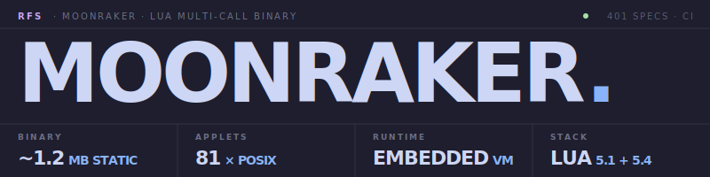

<div align="center">

<picture>
  <source media="(prefers-color-scheme: dark)" srcset="docs/assets/logo-dark.svg">
  <source media="(prefers-color-scheme: light)" srcset="docs/assets/logo-light.svg">
  
</picture>

[](https://github.com/Real-Fruit-Snacks/Moonraker/actions/workflows/ci.yml)
[](https://github.com/Real-Fruit-Snacks/Moonraker/releases/latest)


A BusyBox-style multi-call binary in Lua — **81 Unix utilities**, one ~1.2 MB executable. Lua 5.1 / 5.4 portable; Linux + macOS binaries published with each release.

[Releases](https://github.com/Real-Fruit-Snacks/Moonraker/releases) · [Changelog](CHANGELOG.md)

</div>

---

## Install

### From a release

```bash
# Linux x86_64 (glibc 2.35+: Ubuntu 22.04+, Debian 12+, RHEL 8/9, …)
curl -LO https://github.com/Real-Fruit-Snacks/Moonraker/releases/latest/download/moonraker-linux-x64
chmod +x moonraker-linux-x64
./moonraker-linux-x64 --version

# macOS (Apple Silicon)
curl -LO https://github.com/Real-Fruit-Snacks/Moonraker/releases/latest/download/moonraker-macos-arm64
chmod +x moonraker-macos-arm64
./moonraker-macos-arm64 --list
```

### From source

Requires Lua 5.4 (or 5.1), [LuaRocks](https://luarocks.org/), and a C toolchain (gcc / clang / MSVC).

```bash
luarocks install --local luastatic busted luacheck luafilesystem lua-zlib lpeg luasocket
make build
./dist/moonraker --list
./dist/moonraker echo "hello, world"
```

CI verifies the build on Linux (Ubuntu 22.04, glibc 2.35) and macOS. Local Windows builds work via MSYS2/mingw (`gcc`); a Windows binary in releases is a follow-up once the runner-side MSVC environment is wired up.

### Multi-call dispatch

Symlink or hardlink the binary to an applet name and call it directly:

```bash
ln -s ./dist/moonraker /usr/local/bin/echo
echo "hello"
```

Or invoke through the wrapper:

```bash
moonraker echo "hello"
moonraker pwd
moonraker --list
moonraker --help
moonraker awk --help              # per-applet help
```

### Wire up your shell

```bash
moonraker install-aliases ~/.local/bin                                  # symlink each applet
moonraker completions bash | sudo tee /etc/bash_completion.d/moonraker  # tab-complete applets
```

---

## Build

`build.lua` auto-discovers applets, vendor/ Lua deps, and cdeps/ C subdirectories. To pick a subset:

```bash
lua build.lua --preset minimal               # 4 applets (true, false, echo, pwd)
lua build.lua --applets ls,cat,grep,sed,awk  # hand-picked
lua build.lua                                # full (81 applets)
lua build.lua --regen-only                   # refresh src/applets/init.lua only
```

The result is a single statically-linked binary at `dist/moonraker` (or `dist/moonraker.exe` on Windows). No Lua runtime needed alongside it — luastatic embeds the interpreter, your scripts, and every C dependency.

---

## Features

### One binary, eighty-one utilities

Every common POSIX tool you'd reach for in a shell pipeline — plus `http` for HTTP, `dig` for DNS, `nc` for TCP, hashing (`md5sum`/`sha*sum`), archives (`gzip` / `tar` with gzip + bzip2 / `zip`), and the BusyBox parity gap-fillers (`dd`, `od`, `hexdump`, `fmt`, …). Dispatch via `moonraker <applet>` or symlink/hardlink to call the applet directly.

```bash
moonraker ls -la                          # GNU-style flags
moonraker cat file.txt | moonraker grep -C 2 pattern
moonraker find . -name '*.lua' -size +1k -mtime -7
moonraker seq 100 | moonraker sort -rn | moonraker head -5
```

### Real applets, not stubs

Each applet implements the common POSIX flags and edge cases.

- `find` — expression tree with `-exec`, `-prune`, `-and`/`-or`, parens, size/time predicates, `-delete`
- `sed` — `s///`, `d`, `p`, `q`, `=`, `y///`, addresses, ranges, negation, `-i` in-place edit, BRE + ERE
- `awk` — BEGIN/END, `/regex/` and expression patterns, range patterns, `print`/`printf`, full control flow, associative arrays, the standard built-ins (`length`, `substr`, `index`, `split`, `sub`, `gsub`, `match`, `toupper`, `tolower`, `sprintf`, `int`, math functions)
- `tar` — create/extract/list with gzip (`-z`) and bzip2 (`-j`) filters
- `http` — `GET`/`POST`/`PUT`/`DELETE`/`HEAD`, custom headers, body literal or `@file`, `--json` shortcut, redirect-following, `--fail` for HTTP errors
- `dig` — direct UDP DNS queries: A, AAAA, MX, TXT, CNAME, NS, SOA, PTR; `+short`; reverse lookups via `-x`
- `zip` / `unzip` — PKZip 2.0 reader and writer with stored + deflated entries; path-traversal-safe extract
- `gzip` / `gunzip` — streaming compress/decompress, level 1–9

```bash
moonraker find . -name '*.tmp' -delete
moonraker sed -i 's/foo/bar/g' *.txt
moonraker awk -F, '{s+=$3} END{print s/NR}' data.csv
moonraker http -H 'Authorization: Bearer $TOKEN' https://api.example.com/me
moonraker dig MX gmail.com +short
moonraker tar -czf src.tar.gz src/ --exclude='*.bak'
```

### Vendored, hermetic build

Everything links statically into one binary. C dependencies live under `src/cdeps/` and pure-Lua deps under `src/vendor/`:

- **LPeg 1.1.0** — Roberto Ierusalimschy's parsing-expression-grammar engine, MIT
- **zlib 1.3.1** — Gailly + Adler, with the `lua-zlib` 1.4-0 binding (MIT)
- **bzip2 1.0.8** — Julian Seward, with our own minimal Lua binding (~150 lines)
- **LuaSocket 3.1.0** — Diego Nehab; POSIX TCP/UDP/select sources only
- **pure_lua_SHA v12** — Egor Skriptunoff; backs the `*sum` applets (no OpenSSL needed)
- **re.lua** — LPeg's regex frontend
- **`src/regex.lua`** — our POSIX ERE-on-LPeg compiler used by `sed` and `awk`

### Pipeline-grade I/O

Binary-safe through `cat`/`tee`/`gzip`. `tail -f` follows files. Stdin streaming works correctly under `head -n` even when the producer is `yes` (won't try to slurp infinite input).

```bash
moonraker find . -type f -print0 | moonraker xargs -0 moonraker sha256sum
moonraker tail -f /var/log/app.log
moonraker gzip -c data.bin | moonraker gunzip > data.bin.copy
```

### Test coverage

401 busted specs covering the dispatcher, registry, every applet, and the regex layer. luacheck-clean. Run `make test` to execute the suite locally.

---

## Supported applets

| Category | Applets |
|----------|---------|
| File ops | `ls` `cp` `mv` `rm` `mkdir` `touch` `find` `chmod` `ln` `stat` `truncate` `mktemp` `dd` |
| Text | `cat` `tac` `rev` `grep` `head` `tail` `wc` `nl` `sort` `uniq` `cut` `paste` `tr` `sed` `awk` `tee` `xargs` `printf` `echo` `expand` `unexpand` `split` `cmp` `comm` `fmt` `fold` `column` `od` `hexdump` `base64` |
| **Network** | **`http`** _(curl-style GET/POST with headers, body, JSON, redirects)_ • **`dig`** _(DNS A/AAAA/MX/TXT/CNAME/NS/SOA/PTR via direct UDP queries)_ • **`nc`** _(TCP netcat: connect, listen, port-scan)_ |
| Hashing | `md5sum` `sha1sum` `sha256sum` `sha512sum` |
| Archives | `tar` `gzip` `gunzip` `zip` `unzip` |
| Filesystem | `du` `df` |
| Paths | `basename` `dirname` `realpath` `pwd` `which` |
| Process | `watch` `timeout` |
| System | `uname` `hostname` `whoami` `id` `groups` `date` `env` `sleep` `getopt` `uuidgen` |
| Control | `true` `false` `yes` `seq` |
| **Lifecycle** | **`install-aliases`** _(symlink every applet into a target dir so `ls` runs Moonraker's ls)_ • **`completions`** _(emit bash/zsh/fish/powershell completion scripts)_ • **`update`** _(self-update from the latest GitHub release; atomic replace, keeps `.old` next to the binary)_ |

Run `moonraker --list` for the full set with one-line descriptions, or `moonraker <applet> --help` for per-applet usage and flags.

**Not yet shipped:** `jq` (planned), `tar -J` (xz; deferred — autoconf-heavy build for low ROI), `awk` user-defined functions and `getline`.

---

## Architecture

```
moonraker/
├── src/
│   ├── main.lua          entry point
│   ├── cli.lua           dispatch: argv[0] multi-call + subcommand modes
│   ├── registry.lua      applet table + loader
│   ├── common.lua        shared helpers (err, IO, paths, walk, fnmatch)
│   ├── regex.lua         POSIX ERE-on-LPeg compiler
│   ├── hashing.lua       shared *sum logic
│   ├── socket.lua        LuaSocket helper (vendored alongside its C twin)
│   ├── usage.lua         per-applet --help text
│   ├── version.lua       version constant
│   ├── applets/          81 modules; each exports {name, help, aliases, main}
│   ├── vendor/           pure-Lua deps (re.lua, sha2.lua)
│   └── cdeps/            vendored C source — lpeg, zlib, bzip2, luasocket
├── spec/                 busted tests, mirrors src/ layout
├── docs/                 architecture docs + GitHub Pages
├── build.lua             luastatic-based build orchestration
├── Makefile              developer entry points
└── .github/workflows/    CI matrix (Linux, Windows, macOS)
```

**Four-layer flow:**

1. **Entry** — `src/main.lua` stashes the running binary path (for `update`), then enters `cli.main(arg)`.
2. **Dispatch** — `cli.lua` checks `argv[0]` basename for multi-call (e.g. `ls -la` when symlinked); otherwise treats `argv[1]` as the applet name. Intercepts `--help` (long form only — `-h` is reserved for applet flags like `df -h`).
3. **Registry** — `src/applets/init.lua` (auto-generated by `build.lua`) loads each applet module into the registry; each exports `{name, help, aliases, main(argv) -> integer}`.
4. **Applet** — receives `argv` as a Lua table, returns an exit code (`0` success, `1` runtime error, `2` usage error). Reads stdin via `io.stdin`; writes via `io.stdout` / `io.stderr`.

Adding a new applet means dropping a module into `src/applets/` with the four-symbol contract and re-running `lua build.lua --regen-only`.

See [docs/architecture.md](docs/architecture.md) for the longer write-up.

---

## Development

```bash
make test                # busted suite (401 specs + 1 pending bz2)
make lint                # luacheck
make fmt                 # stylua
make build               # full binary via luastatic
make clean               # remove build artifacts
```

WSL is the recommended local dev environment on Windows; Ubuntu 22.04's Lua 5.1 has working LuaRocks (lua-sec for 5.4 has a known SSL bug there). The codebase is portable across Lua 5.1 and 5.4 — CI tests both, while local dev uses 5.1.

---

## License

MIT — see [LICENSE](LICENSE). Vendored third-party libraries keep their original licenses; see [NOTICE](NOTICE) for the full attribution stack (LPeg, zlib, bzip2, LuaSocket, pure_lua_SHA, luastatic).
